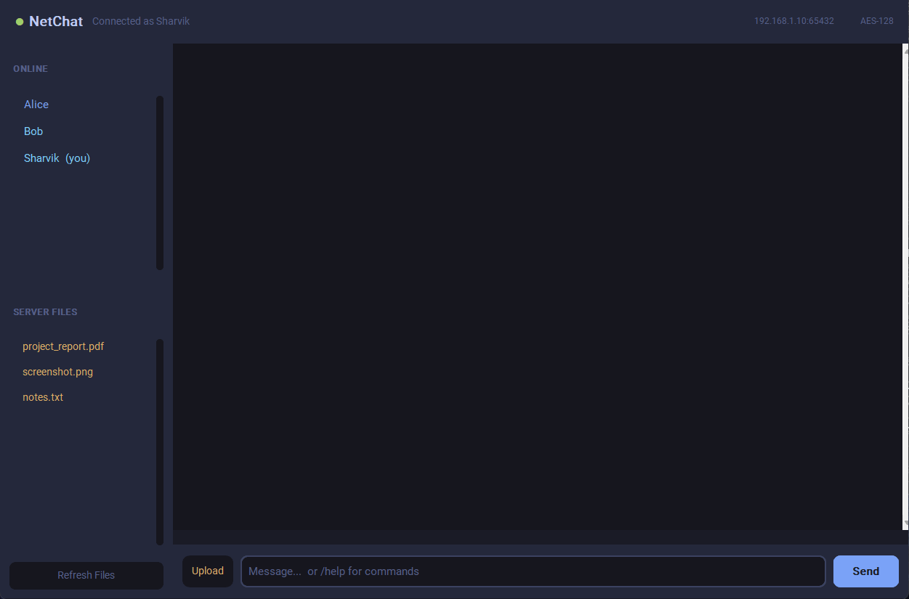
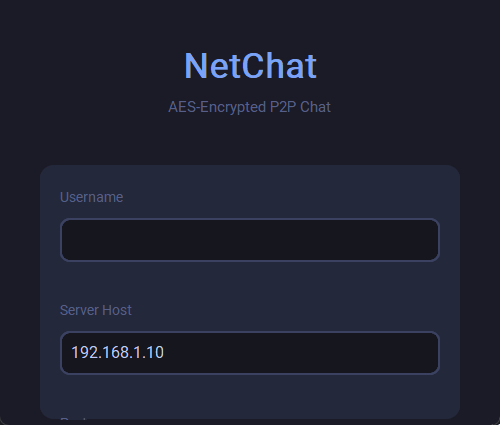

<div align="center">

# NetChat — AES-Encrypted P2P Chat

[](https://python.org)
[](https://cryptography.io)
[](https://customtkinter.tomschimansky.com)
[](LICENSE)
[](README.md)

**Real-time encrypted group chat — built in pure Python.**

*Messages, files, and everything in between — all protected by AES-128 encryption.*

---

### Live Demo



---

</div>

## Screenshots

<table>
  <tr>
    <td align="center"><b>Login — type your name, enter the server IP</b></td>
    <td align="center"><b>Chat — dark UI, users sidebar, file browser</b></td>
  </tr>
  <tr>
    <td></td>
    <td></td>
  </tr>
  <tr>
    <td align="center" colspan="2"><b>Typing username — animated login flow</b></td>
  </tr>
  <tr>
    <td colspan="2" align="center"></td>
  </tr>
</table>

---

## Features

### Security
- **AES-128 encrypted file storage** — files are encrypted with Fernet (AES-128-CBC + HMAC-SHA256) before the server writes them to disk; stored as `.enc` files, unreadable without the key
- **Encrypted transport** — the same shared key protects all binary payloads in transit
- **No plaintext on disk** — not a single byte of user data is stored in clear text

### Communication
- **Group chat** — unlimited simultaneous users; every message is broadcast in real time
- **Direct messages** — `/dm <user> <message>` for private one-on-one conversations
- **Live typing indicators** — see who's composing a message right now
- **Message history on join** — new users receive the last 50 messages automatically

### Interface
- **Modern dark UI** — Tokyo Night-inspired theme via `customtkinter`
- **Online users sidebar** — click any name to instantly start a DM
- **Server file browser** — browse, upload, and download encrypted shared files
- **Clickable file links** — click any file notification in chat to download immediately
- **Slash commands** — `/help`, `/dm`, `/files`, `/clear`
- **LAN-ready server** — bind to `0.0.0.0`; share your IP and anyone on the network joins

---

## Architecture

```
┌──────────────────────────────────────────────────────────────────┐
│  client.py  (customtkinter dark GUI)                              │
│  ┌──────────────┬───────────────────────────────────────────┐    │
│  │ ONLINE       │  Alice  14:31                             │    │
│  │ ● Alice      │  Hey everyone! Testing NetChat v2.0       │    │
│  │ ● Bob        │                                           │    │
│  │ ● Sharvik    │  Bob  14:31                               │    │
│  │              │  Dark theme looks amazing                  │    │
│  │ SERVER FILES │                                           │    │
│  │ report.pdf   │  [FILE] Sharvik shared report.pdf         │    │
│  │ photo.png    │  -- click to download --                  │    │
│  └──────────────┤                                           │    │
│                 │  [Alice is typing...]                      │    │
│                 │  Upload  | Message...          [ Send ]   │    │
│                 └───────────────────────────────────────────┘    │
└──────────────────────────────┬───────────────────────────────────┘
        Length-prefixed JSON + binary blobs over TCP :65432
        All file payloads are AES-128 Fernet ciphertext
┌──────────────────────────────┴───────────────────────────────────┐
│  server.py  (multi-threaded relay)                                │
│  ● Registers usernames, enforces uniqueness per session           │
│  ● Broadcasts chat messages + forwards typing indicators          │
│  ● Routes DMs directly to the target connection                   │
│  ● Encrypts uploads  →  server_files/<name>.enc                  │
│  ● Decrypts and streams files back on download request           │
│  ● Keeps last 50 messages in memory for history-on-join          │
└──────────────────────────────────────────────────────────────────┘
```

### Wire Protocol

Every packet is framed with an 8-byte length prefix for reliable TCP delivery:

```
[ 4 B: JSON length ] [ 4 B: blob length ] [ N bytes: JSON ] [ M bytes: binary blob ]
```

| Direction | `type` | Purpose |
|---|---|---|
| C → S | `join` | Register username |
| C → S | `chat` | Broadcast message |
| C → S | `dm` | Direct message |
| C → S | `typing` | Typing indicator on/off |
| C → S | `file_upload` | Upload file (blob = raw bytes) |
| C → S | `file_download` | Request a stored file |
| C → S | `get_files` | List stored files |
| S → C | `join_ack` | Confirmation + message history |
| S → C | `chat` | Incoming message |
| S → C | `dm` | Incoming DM |
| S → C | `user_list` | Updated online roster |
| S → C | `file_notification` | Someone uploaded a file |
| S → C | `file_download_start` | File data (blob = Fernet token) |
| S → C | `file_list` | Names of stored files |
| S → C | `typing` | Typing indicator forwarded |
| S → C | `system` | Join / leave / error notices |

---

## Quick Start

### 1. Clone and install

```bash
git clone https://github.com/SharvikS/P2P-Chat-And-Server-Side-Encryption-Using-AES.git
cd P2P-Chat-And-Server-Side-Encryption-Using-AES
pip install -r requirements.txt
```

### 2. Start the server

```bash
python server.py
```

```
----------------------------------------------
  NetChat Server v2.0
  Listening on 0.0.0.0:65432
  AES-128 Fernet encryption  |  LAN-ready
  Files stored in: server_files/
----------------------------------------------
```

Custom address:

```bash
python server.py --host 192.168.1.10 --port 9000
```

### 3. Launch clients

```bash
python client.py                         # localhost
python client.py --host 192.168.1.10    # LAN server
```

A login dialog opens — enter your username and the server address, click **Connect**.

### LAN setup

```
1. Run the server:        python server.py
2. Find your LAN IP:      ipconfig  (Windows) / ip a  (Linux/Mac)
3. Share the IP with friends on the same network
4. They run:              python client.py --host <your-ip>
```

---

## Commands

| Command | Description |
|---|---|
| `/dm <user> <message>` | Send a private message |
| `/files` | Refresh the server file list in the sidebar |
| `/clear` | Clear the local chat window |
| `/help` | Show command reference |

**Sidebar shortcut:** click any online username to pre-fill `/dm <user>` in the input box.

---

## Security Notes

| Property | Detail |
|---|---|
| Algorithm | AES-128-CBC + HMAC-SHA256 (Python `cryptography` — Fernet) |
| Key | `secret.key` — auto-generated on first run; share with all clients out-of-band |
| File storage | Encrypted before written to disk; `.enc` extension |
| Transport | All binary payloads are Fernet tokens over TCP |
| Auth | Username uniqueness enforced per session; no persistent accounts |

> **For production:** add TLS on the socket layer and replace the shared-key model with asymmetric key exchange (e.g. X25519 ECDH + per-session derived keys).

---

## Project Structure

```
├── server.py            LAN-ready relay server — AES encryption, user management
├── client.py            Dark GUI client — customtkinter, typing indicators, file browser
├── crypto_utils.py      Key loading, encrypt/decrypt helpers
├── config.py            Default host, port, storage path
├── requirements.txt     cryptography, customtkinter
├── generate_assets.py   Generates README screenshots and GIFs from the real UI
├── secret.key           Shared AES key (auto-generated on first run)
├── server_files/        Encrypted file storage (created at runtime)
├── assets/              Screenshots and GIFs for this README
├── ser2.py              Original v1 server (kept for reference)
└── cli2.py              Original v1 client (kept for reference)
```

---

## Tech Stack

| Layer | Technology |
|---|---|
| GUI | `customtkinter` 5.x (modern Tkinter wrapper) |
| Encryption | `cryptography` — Fernet (AES-128-CBC + HMAC-SHA256) |
| Networking | `socket` stdlib — raw TCP |
| Concurrency | `threading` stdlib — one thread per client |
| Protocol | 8-byte length-prefixed JSON + binary blobs |

---

<div align="center">
Built by <a href="https://github.com/SharvikS">Sharvik</a>
&nbsp;|&nbsp;
<a href="https://github.com/SharvikS/P2P-Chat-And-Server-Side-Encryption-Using-AES">GitHub Repository</a>
</div>
