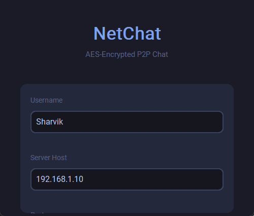
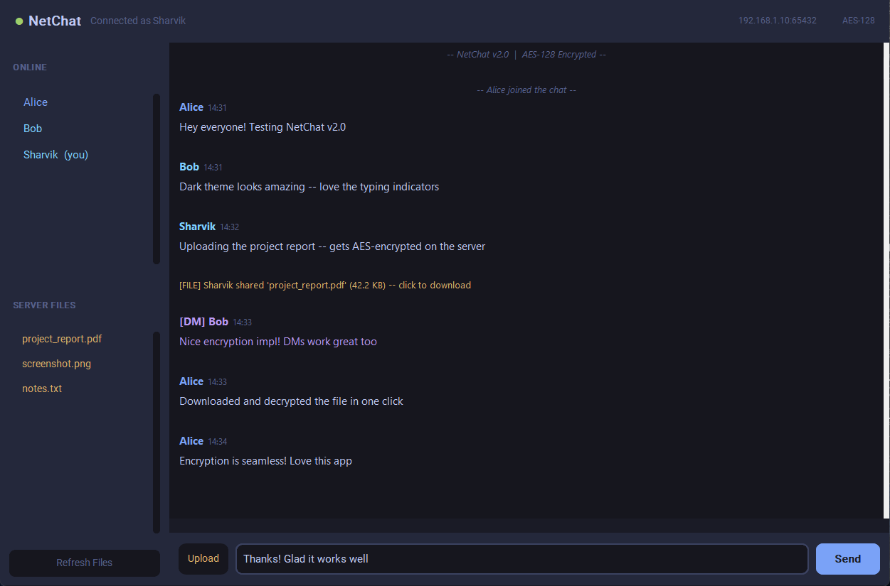

<div align="center">

# NetChat — AES-Encrypted P2P Chat

[](https://python.org)
[](https://cryptography.io)
[](https://customtkinter.tomschimansky.com)
[](LICENSE)
[](README.md)

**Real-time encrypted group chat with a modern dark UI — built in pure Python.**

*Messages, files, and everything in between — all protected by AES-128 encryption.*

</div>

---

## Preview

> **Tip:** After running the app, capture screenshots with [ShareX](https://getsharex.com/) and GIFs with [LICEcap](https://www.cockos.com/licecap/), then replace the placeholders below.

| Login Screen | Chat Window |
|:---:|:---:|
|  |  |

| Online Users + DMs | Encrypted File Transfer |
|:---:|:---:|
|  |  |

---

## Features

### Security
- **AES-128 Encrypted File Storage** — files are encrypted with Fernet (AES-128-CBC + HMAC-SHA256) before the server writes them to disk
- **Encrypted transport** — the same shared key protects all binary payloads in transit
- **No plaintext on disk** — stored files carry the `.enc` extension and are unreadable without the key

### Communication
- **Group chat** — unlimited simultaneous users; every message is broadcast in real time
- **Direct messages** — `/dm <user> <message>` for private conversations
- **Live typing indicators** — see who's composing a message right now
- **Message history on join** — new users receive the last 50 messages automatically

### Interface
- **Modern dark UI** — Tokyo Night-inspired theme via `customtkinter`
- **Online users sidebar** — click any name to instantly start a DM
- **Server file browser** — browse, upload, and download shared files from the sidebar
- **Clickable file links** — click any file notification in chat to download immediately
- **Slash commands** — `/help`, `/dm`, `/files`, `/clear`
- **LAN-ready** — server binds to `0.0.0.0`; share your IP and anyone on the network can join

---

## Architecture

```
┌──────────────────────────────────────────────────────────────────┐
│  client.py  (customtkinter dark GUI)                              │
│  ┌──────────────┬───────────────────────────────────────────┐    │
│  │ ONLINE       │  Alice  12:34                             │    │
│  │ ● Alice      │  Hey everyone! 👋                         │    │
│  │ ● Bob        │                                           │    │
│  │ ● You        │  Bob  12:35                               │    │
│  │              │  @Alice check your DMs                    │    │
│  │ SERVER FILES │                                           │    │
│  │ 📄 report.pdf │  [Alice is typing…]                       │    │
│  │ 🖼 photo.png  │  ────────────────────────────────────     │    │
│  └──────────────┤  📎  Message… or /help       [ Send ]    │    │
│                 └───────────────────────────────────────────┘    │
└──────────────────────────────┬───────────────────────────────────┘
        Length-prefixed JSON + binary blobs over TCP :65432
        All file payloads are AES-128 Fernet tokens
┌──────────────────────────────┴───────────────────────────────────┐
│  server.py  (multi-threaded relay)                                │
│  • Registers usernames, enforces uniqueness                       │
│  • Broadcasts chat messages + typing indicators                   │
│  • Routes DMs directly to the target connection                   │
│  • Encrypts uploads → server_files/<name>.enc                    │
│  • Decrypts & streams files back on download request             │
│  • Keeps the last 50 messages in memory for history-on-join      │
└──────────────────────────────────────────────────────────────────┘
```

### Wire Protocol

Every packet is framed with a length prefix for reliable TCP delivery:

```
┌──────────────┬────────────────┬──────────────┬──────────────────┐
│  4 B         │  4 B           │  N bytes     │  M bytes         │
│  JSON length │  blob length   │  JSON        │  binary blob     │
└──────────────┴────────────────┴──────────────┴──────────────────┘
```

| Direction | `type` field | Purpose |
|---|---|---|
| C → S | `join` | Register username |
| C → S | `chat` | Broadcast message |
| C → S | `dm` | Direct message |
| C → S | `typing` | Typing indicator on/off |
| C → S | `file_upload` | Upload file (blob = raw bytes) |
| C → S | `file_download` | Request a stored file |
| C → S | `get_files` | List stored files |
| S → C | `join_ack` | Confirmation + message history |
| S → C | `chat` | Incoming chat message |
| S → C | `dm` | Incoming direct message |
| S → C | `user_list` | Updated online roster |
| S → C | `file_notification` | Someone uploaded a file |
| S → C | `file_download_start` | File data (blob = Fernet token) |
| S → C | `file_list` | Names of stored files |
| S → C | `typing` | Typing indicator forwarded |
| S → C | `system` | Join / leave / error notices |

---

## Quick Start

### 1. Clone & install

```bash
git clone https://github.com/SharvikS/P2P-Chat-And-Server-Side-Encryption-Using-AES.git
cd P2P-Chat-And-Server-Side-Encryption-Using-AES
pip install -r requirements.txt
```

### 2. Start the server

```bash
python server.py
```

```
──────────────────────────────────────────────
  NetChat Server v2.0
  ● Listening on 0.0.0.0:65432
  🔐 AES-128 Fernet encryption  |  LAN-ready
  Files stored in: server_files/
──────────────────────────────────────────────
```

Custom host / port:

```bash
python server.py --host 192.168.1.10 --port 9000
```

### 3. Launch a client

```bash
python client.py                        # connect to localhost
python client.py --host 192.168.1.10   # connect to LAN server
```

A login dialog appears — enter your username and server address, then click **Connect**.

### LAN party setup

```
1. Run the server on one machine:   python server.py
2. Find your LAN IP:                ipconfig   (Windows)  /  ip a  (Linux/Mac)
3. Share that IP with teammates
4. Everyone else runs:              python client.py --host <your-ip>
```

---

## Commands

| Command | Description |
|---|---|
| `/dm <user> <message>` | Send a private message |
| `/files` | Refresh the server file list in the sidebar |
| `/clear` | Clear the local chat window |
| `/help` | Show command reference |

**Sidebar shortcut:** click any online user to pre-fill `/dm <user>` in the input box.

---

## Security Notes

| Property | Detail |
|---|---|
| Algorithm | AES-128-CBC + HMAC-SHA256 via Python `cryptography` Fernet |
| Key storage | `secret.key` — auto-generated on first run; distribute to all clients out-of-band |
| File encryption | Files are encrypted before the server writes them to disk |
| Transport | All binary payloads are Fernet tokens; TCP with no TLS layer |
| Authentication | Username uniqueness enforced per session; no persistent accounts |

> **Production note:** For a real deployment, add TLS on the socket layer and replace the shared-key model with asymmetric key exchange (e.g. X25519 ECDH + per-session derived keys).

---

## Project Structure

```
├── server.py          ← Relay server: LAN-ready, AES encryption, user management
├── client.py          ← Dark GUI client: customtkinter, typing indicators, file browser
├── crypto_utils.py    ← Key loading, encrypt/decrypt helpers
├── config.py          ← Default host, port, storage path
├── requirements.txt   ← cryptography, customtkinter
├── secret.key         ← Shared AES key (auto-generated on first run)
├── server_files/      ← Encrypted file storage (created at runtime)
├── assets/            ← Screenshots and GIFs for this README
├── ser2.py            ← Original v1 server (kept for reference)
└── cli2.py            ← Original v1 client (kept for reference)
```

---

## Tech Stack

| Layer | Technology |
|---|---|
| GUI | `customtkinter` 5.x (modern Tkinter wrapper) |
| Encryption | `cryptography` — Fernet (AES-128-CBC + HMAC-SHA256) |
| Networking | `socket` stdlib — raw TCP |
| Concurrency | `threading` stdlib — one thread per client |
| Protocol | 8-byte length-prefixed JSON + binary blobs |

---

<div align="center">
Built by <a href="https://github.com/SharvikS">Sharvik</a> &nbsp;|&nbsp;
<a href="https://github.com/SharvikS/P2P-Chat-And-Server-Side-Encryption-Using-AES">GitHub Repository</a>
</div>
